# @bagakit/open-agent-avatars

A ready-to-use set of masterpiece Low Poly avatar SVGs (with built-in micro-animations) for quickly bootstrapping AI agent projects, NFT collections, or gamified UIs.

Designed in the **"Alex Pixel Cutter"** style: vibrant colors, clean geometric boundaries, subtle 3D depth, and premium golden outlines.

## Showcase

| Programming | Designing | Fighting | Researching |
| :---: | :---: | :---: | :---: |
|  |  |  |  |
| **Planning** | **Speaking** | **Crafting** | **Studying** |
|  |  |  |  |

## Install

```bash
npm i @bagakit/open-agent-avatars
```

## Use

### 1. Modern Tree-shaking Import (Recommended)

Each icon is available as a separate ESM module for minimal bundle size.

```javascript
import PANDA_PROGRAMMING from "@bagakit/open-agent-avatars/20260202/PANDA_PROGRAMMING";

// In React
function AgentAvatar() {
  return ;
}
```

### 2. Import from Batch Index

```javascript
import { FOX_DESIGNING, CAT_FIGHTING } from "@bagakit/open-agent-avatars/20260202";

console.log(FOX_DESIGNING); // URL to the SVG
```

### 3. Dynamic Search / Browse

Access the full metadata list to build a searchable avatar picker.

```javascript
import { avatars } from "@bagakit/open-agent-avatars";

// Find all "Capybara" avatars
const capybaras = avatars.filter(a => a.tokens.includes("Capybara"));

// Find a specific combination
const coder = avatars.find(a => 
  a.tokens.includes("Dog") && a.tokens.includes("Programming")
);

if (coder) {
  const img = new Image();
  img.src = coder.url;
  document.body.appendChild(img);
}
```

## Bundler Notes (Vite Pitfall)

Some Vite setups may prebundle this package and turn `new URL(..., import.meta.url)` into
file paths that the dev server cannot serve, resulting in broken `` values.

If icons do not render in Vite, add:

```js
// vite.config.js
export default defineConfig({
  assetsInclude: ["**/*.svg"],
  optimizeDeps: { exclude: ["@bagakit/open-agent-avatars"] },
});
```

## Available Content

- **Animals**: Panda, Owl, Dog, Cat, Elephant, Mouse, Dragon, Snake, Sheep, Goat, Ox, Capybara, Fox, Rabbit, Rhino, Shark, Whale.
- **Professions**: Paper Working, Programming, Planning, Designing, Researching, Studying, Crafting, Fighting, Spelling, Speaking.

## Style Features

- **Chibi Style**: Cute, high-head-to-body ratio focus.
- **Low Poly**: Masterpiece quality geometric mesh.
- **Micro-Animations**: Built-in CSS animations for floating, blinking, and accessory-specific movements (ear twitch, lens sheen, etc.).
- **NFT Grade**: Crisp boundaries, golden "enamel pin" outline, and soft drop shadows.

## Maintenance

To regenerate the index files:
```bash
npm run generate
```

To (re)generate the `20260202/` batch assets (maintainers only):
```bash
node ./scripts/generate-new-avatars.mjs
```

## License

MIT
